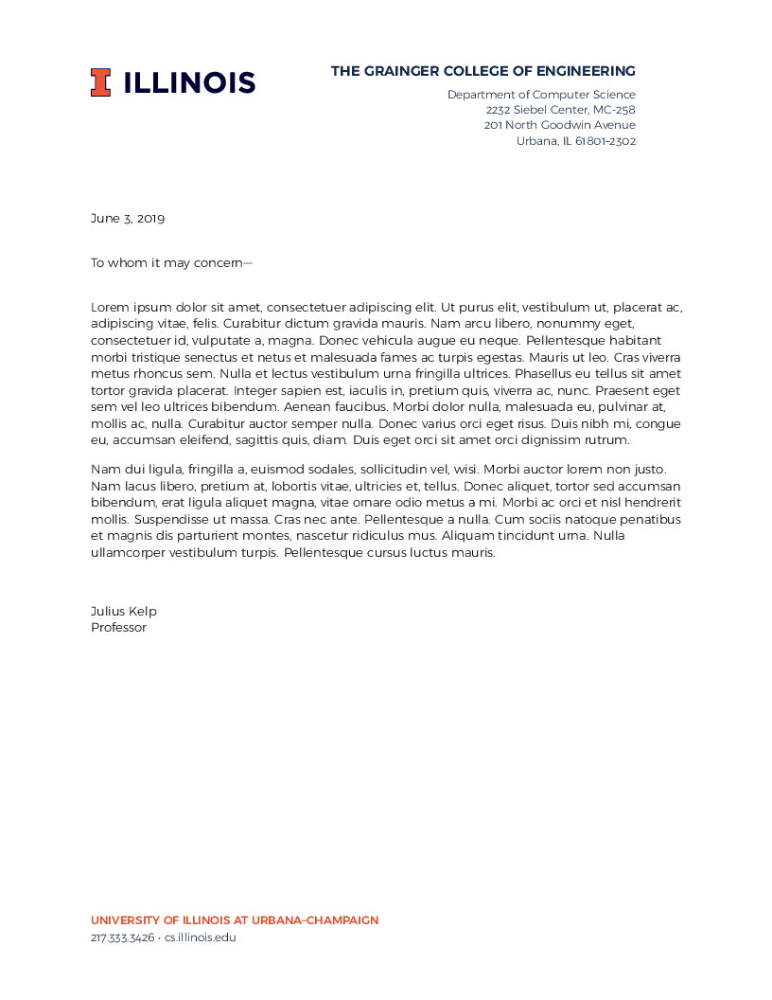

### What is this?

This is an attempt (based on [a project](https://github.com/lukeolson/illinois-letterhead) by
[Luke Olson](https://github.com/lukeolson)) to reproduce the current Illinois letterhead in LaTeX.

This is the “space-saving” format with "The Grainger College of Engineering" branding and [the block I](http://creativeservices.illinois.edu/brand/).

### How do I use it?

The official letterhead appears to use the [Gotham](https://www.typography.com/fonts/gotham/overview/) font.
A sufficiently similar freely available alternative is the [Montserrat](https://ctan.org/tex-archive/fonts/montserrat?lang=en) font,
which is used here and is included in TexLive.

Use `template.tex`, it includes the logo and font style through `illinois.tex`.

### What does it look like?

